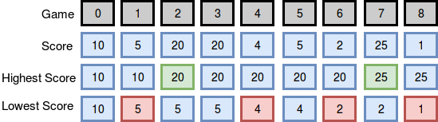

# Breaking The Record

Maria plays college basketball and wants to go pro. Each season she maintains a record of her play. She tabulates the
number of times she breaks her season record for most points and least points in a game. Points scored in the first game
establish her record for the season, and she begins counting from there.

HackerRank - [Problem](https://www.hackerrank.com/challenges/breaking-best-and-worst-records)

<b>Example</b>

`scores = [12,24,10,24]`

Scores are in the same order as the games played. She tabulates her results as follows:

#

Input:
> `9`  
> `10 5 20 20 4 5 2 25 1`

Output:
> `2 4`

Explanation 0

The diagram below depicts the number of times Maria broke her best and worst records throughout the season:
# 

# 
She broke her best record twice (after games `2`and `7`) and her worst record four times (after games `1,4 ,6 ,8` and ),
so we print 2 4 as our answer. Note that she did not break her record for best score during game , as her score during
that game was not strictly greater than her best record at the time.
